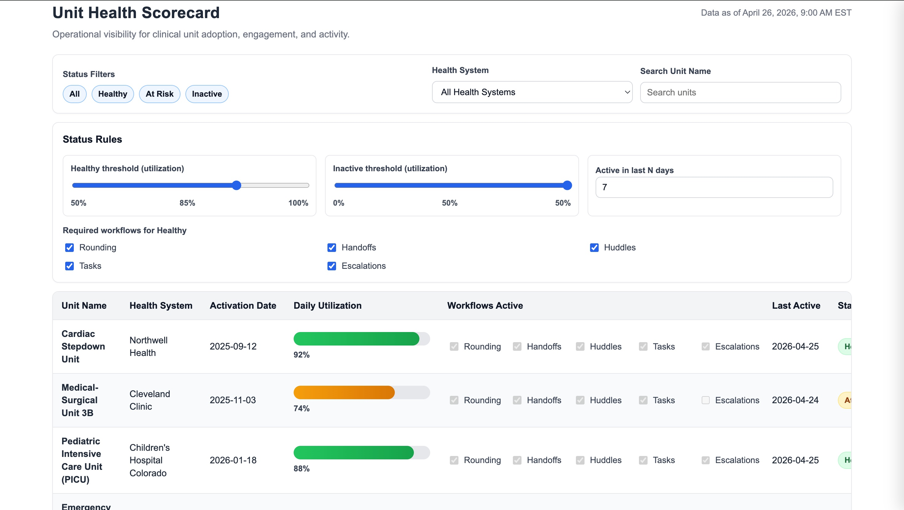
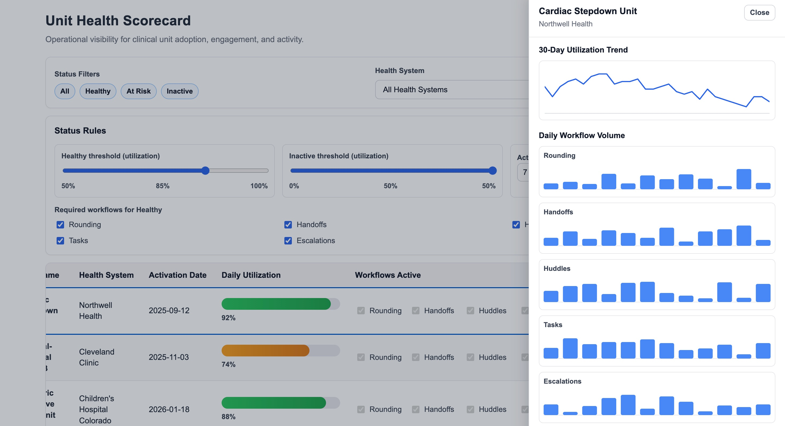

# Unit Health Scorecard

A working prototype exploring how operator dashboards surface configuration and data-model questions at scale in healthcare operations software.

## The problem

Operations software for hospital leaders typically digitizes a set of routine clinical workflows at the level of individual nursing units. As these platforms grow across hundreds or thousands of units, the operator dashboard has to answer "which units need attention right now," not "is anything working."

That question is harder than it looks. Status logic is contested (a PICU at 88% utilization reads very differently than a Med-Surg unit at 88%). The data model has to distinguish config-driven inactivity from usage-driven inactivity. The UI has to scale past the first dozen rows.

This prototype is one take on the operator view.

## What it does

- Lists clinical units with utilization, workflow activity, and a computed status
- Status logic is configurable in real time via a Status Rules panel: utilization thresholds, required workflows, activity window
- Row click opens a unit detail drawer with 30-day utilization trend, per-workflow daily volume, and a contact card
- Filter bar with status, health system, and unit name search
- Single HTML file, vanilla JavaScript, no frameworks

## What's mocked

- All units and their data are fictional, paired with real health system names
- 30-day trend sparklines are deterministic mock from a unit-name hash
- Workflow daily volume bars are mock
- Contact cards are placeholder names
- Status thresholds are configurable in the UI but not persisted between sessions

## Open questions worth pressure-testing

The UI is the artifact. The interesting questions live underneath:

- How is utilization computed, and at what aggregation cadence?
- Are workflow thresholds and roles configurable per unit, or hardcoded?
- Is there a dimension in the data model that distinguishes config-driven workflow inactivity from usage-driven inactivity?
- Should status logic be global, per-health-system, or per-unit-type?
- How does a new unit get activated end to end, and where does the bottleneck live?
- What's the right action surface after an operator identifies an at-risk unit?

## Stack

- Single HTML file
- Vanilla JavaScript, no frameworks
- Inline CSS
- Built in Cursor

## Running locally

Clone the repo and open `unit-health-scorecard.html` in any modern browser. No build step, no dependencies.

## Live demo

[Add Vercel or Netlify URL here]
